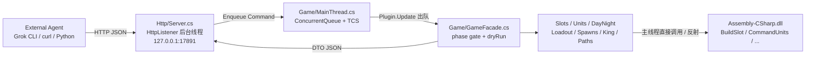
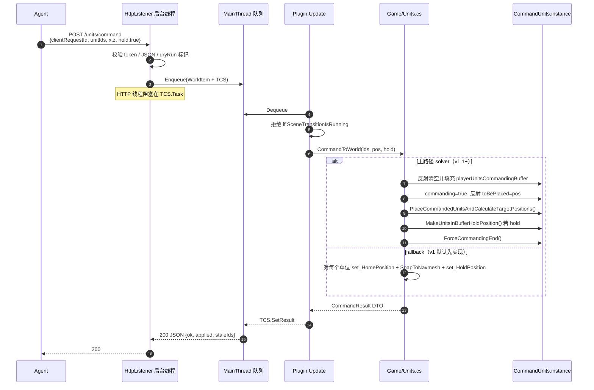
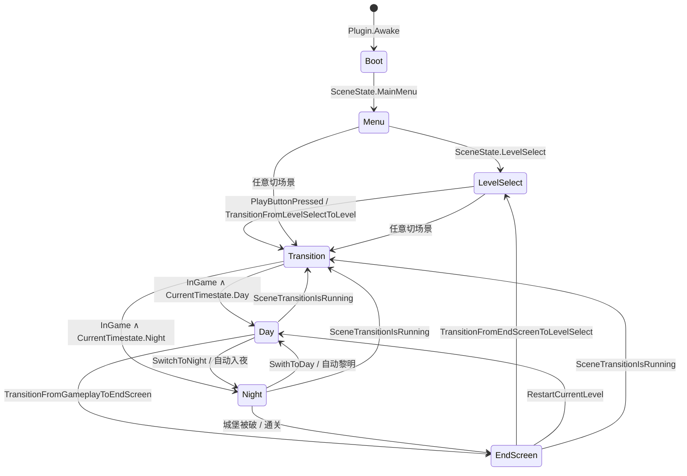

# Thronefall Local Control Plugin（BepInEx）实现设计

| 字段 | 值 |
| --- | --- |
| 标题 | Thronefall Local Control Plugin（BepInEx）— 本地 HTTP 执行器 |
| 作者 | TBD |
| 日期 | 2026-08-30 |
| 状态 | Draft |
| 目标游戏 | Thronefall v2.13（Steam AppID `2239150`） |
| 运行时 | Unity 2022.3.62f2 Mono（`MonoBleedingEdge`），`netstandard 2.1.0.0` |
| 平台 | macOS universal binary `arm64` + `x86_64`，bundle `com.grizzlygames.thronefall` |
| 程序集 | `thronefall.app/Contents/Resources/Data/Managed/Assembly-CSharp.dll`（2.6 MB，3481 TypeDef） |

本文所有类型 / 方法 / 字段名均来自 v2.13 `Assembly-CSharp.dll` 的元数据，不以 Windows Thunderstore pack 或 IL2CPP 假设为准。

---

## Overview

Thronefall 是一款日夜循环的 RTS/塔防：白天在离散 `BuildSlot` 上建造、收税、点升级；夜晚把玩家单位派到世界坐标守线。本仓库实现一个 **BepInEx 5 Mono 插件**，注入正在运行的 Unity Player，在 `127.0.0.1` 上暴露 JSON HTTP API，把已经逆向过的进程内 C# 方法包装成外部 agent（Grok CLI）可调用的观察器 + 执行器。

这 **不是** 云服务，**不是** 多人协议，**不包含** 经济/布阵策略。插件只做三件事：(1) 在主线程安全地读状态；(2) 调用游戏自己的方法改变状态；(3) 把结果以稳定 ID 的 JSON 返回。策略层（先经济还是先兵、单位对塔、spawn-line posting）全部在外部 agent。

---

## Background & Motivation

### 当前状态

用户在 macOS + Steam 上游玩 Thronefall v2.13。游戏是 **Mono 而非 IL2CPP**，可执行文件为 universal Mach-O：

```
~/Library/Application Support/Steam/steamapps/common/Thronefall/thronefall.app
  Contents/MacOS/Thronefall          # arm64 + x86_64
  Contents/Resources/Data/Managed/Assembly-CSharp.dll
  Contents/MonoBleedingEdge/
  Contents/Info.plist                # CFBundleShortVersionString = 2.13
                                     # CFBundleIdentifier = com.grizzlygames.thronefall
                                     # Unity 2022.3.62f2 (7670c08855a9)
```

`Player.log` 显示 `[SaveServices] Using SteamSaveServices`，存档在：

```
~/Library/Application Support/Grizzly Games/Thronefall/
  ThroneSave.sav          # 明文进度（Perk Level、各图 HighscoreV2）
  {Map}.json              # 对局快照（含 GUID_level / NextUpgradeOrBuildCost / knockedOutTonight）
  steam_autocloud.vdf     # Steam Auto Cloud
```

Thunderstore 上的 `BepInEx-BepInExPack_Thronefall-5.4.2100` 按 `Thronefall.exe` + Windows doorstop 预配置，**不能原样用在这份 `.app` 上**。官方文档也只保证 BepInEx 5 的 `Unity.Mono-macos-x64` 包。

### 痛点

1. **OS 级键鼠自动化**（cliclick / Accessibility）在夜晚战斗、镜头、国王走路面前极脆；建筑交互还要求国王走进 `interactionRadius`。
2. **合成 Rewired 输入** 需要 Harmony patch，且仍走“走路 → 聚焦 → 按键”的人类路径。
3. 游戏已经把所有关键操作做成 **可直接调用的 C# 方法**（`BuildSlot.TryToBuildOrUpgradeAndPay`、`BuildingInteractor.Harvest`、`CommandUnits.PlaceCommandedUnitsAndCalculateTargetPositions`）。插件应该走这条路，而不是模拟手。
4. 外部 agent 需要 **稳定、可脚本化、可 dry-run** 的本地协议，而不是截图+OCR。

---

## Goals & Non-Goals

### Goals（v1 必须覆盖）

1. **观察**：金币 / 能量核 / 净值、日夜、国王 HP/位置/死亡、每个 `BuildSlot`、每个玩家单位、敌军摘要、每条 `EnemySpawnLine`、开路器、当前场景、loadout、战斗数值。
2. **经济 / 建筑**：进程内收获、建造、升级、选择分支；**不需要国王走到建筑旁**。
3. **Loadout / 选图**：选 perk/武器/mutator，启动关卡。
4. **日夜**：在 `PlayerInteraction.IsFreeToCallNight` 为真时调用 `DayNightCycle.SwitchToNight`。默认 **不跳波**。
5. **单位派遣**：按 id / 类型 / 控制组把单位派到世界坐标；走游戏自己的 placement solver，失败则 fallback 到 `HomePosition` + `HoldPosition` + `SnapToNavmesh`。
6. **开路**：`CutOpenPathInteractor.ToggleCutPath`（方法本身是 private，见下文反射表）。
7. **国王便利 + 夜间策略**：传送；`human` / `afk_castle` / `scripted_posts` 三种夜间策略作为 **执行策略**（不是战斗 AI）。
8. **本地 HTTP JSON**：仅 loopback，默认端口 `17891`，主线程队列，`clientRequestId`，`dryRun`。
9. **macOS 安装**：BepInEx 5 unix doorstop + `run_bepinex.sh` 包住 `thronefall.app` + Steam launch options。
10. **安全默认**：无作弊、无 `DEBUGUpgradeToMax`、无 HP hack；HTTP 绑定失败不影响原版游戏。

### Non-Goals

- 经济最优、兵种克制、spawn-line 布阵等 **策略 / AI**（外部 agent 的工作）。
- 国王微操战斗 AI（无自动走位 kiting、无自动放技能）。
- 云同步、远程（非 loopback）控制、多玩家协议。
- 修改 Steam Cloud / 主动写 `LocalMatchSaveLoad.Save`（除非请求显式 save）。
- 默认开启 `CheatMenuIMGUI` / `CheatSystem` / `EnemySpawner.DebugSkipWave`。
- IL2CPP、Windows `.exe`、未经修改的 Thunderstore pack。
- Harmony patch 作为 v1 的硬依赖（见 Key Decisions）。

---

## Key Decisions

| # | 决策 | 理由 |
| --- | --- | --- |
| KD-1 | **协议 = 本地 HTTP JSON + 主线程队列** | CLI agent 最容易打；Unity 对象必须在主线程碰。`HttpListener` 跑在后台线程，命令入队，`Plugin.Update` 出队执行。 |
| KD-2 | **策略在插件外** | 插件是 dumb actuator + observer。同一套 API 可以接 Grok CLI、Python 脚本或人工 curl。 |
| KD-3 | **稳定 ID = `GameObject.GetInstanceID()` + `sceneGeneration`** | instanceID 在场景生命周期内唯一；切场景后 generation 递增，过期 ID 返回 `stale_id` 而不是悄悄打到新对象。建筑额外带 `buildingName`。 |
| KD-4 | **作弊默认关闭** | `enableDebugCheats=false`，`enableDebugUpgradeToMax=false`。`DEBUGUpgradeToMax`、`Hp.MakeInvulerable`、`EnemySpawner.DebugSkipWave`、`Hp.ReviveAllKnockedOutPlayerUnitsAndBuildings` 全部 gated。 |
| KD-5 | **单位命令双路径** | 主路径：反射填 `CommandUnits.playerUnitsCommandingBuffer`，再调公开的 `PlaceCommandedUnitsAndCalculateTargetPositions`。Fallback：逐单位 `set_HomePosition` + `set_HoldPosition` + `SnapToNavmesh`。v1 **先实现 fallback**（solver 的 IL 1077 字节，未完整反编译，可能依赖 `commanding` / `toBePlaced` / 鼠标射线）。 |
| KD-6 | **目标框架 `netstandard2.1` + BepInEx 5 Mono** | `Assembly-CSharp.dll` 的 AssemblyRef 是 `netstandard 2.1.0.0`；游戏带 `netstandard.dll`。不要用 BepInEx 6 IL2CPP 或 net6。 |
| KD-7 | **只绑 loopback** | `HttpListener.Prefixes = http://127.0.0.1:{port}/`。禁止 `0.0.0.0` / `*`。可选 `X-Thronefall-Token`。 |
| KD-8 | **v1 不依赖 Harmony** | BepInEx 5 在 Apple Silicon 上 Harmony/MonoMod 会在 preloader 崩（BepInEx#1303）。本插件只需 **直接调用公开 API + 缓存反射调 private**。避免 Harmony 也降低 Unity 2022.3 上 `HarmonyBackend=cecil` 的运维成本。 |
| KD-9 | **优先公开属性，其次缓存反射** | 例如读 `DayNightCycle.Instance` 而不是 private 字段 `instance`；读 `BuildSlot.Level` 而不是 private `level`。反射只用于确认必须碰到的 private 成员（见 §反射表）。 |
| KD-10 | **JSON 用游戏已加载的 Newtonsoft.Json** | Managed 目录已有 `Newtonsoft.Json.dll`（692 KB）。不引入 `System.Text.Json`（Unity Mono 不一定有），也不用 `JsonUtility`（不支持 `Dictionary` / 多态）。 |
| KD-11 | **不硬编码经济数字** | House 2g、Mill 3/4/6、Tower 3/5/15、Barracks 4/8/16 只作为 agent 策略层的先验。插件永远读 live `NextUpgradeOrBuildCost` / `GoldIncome`。 |
| KD-12 | **HTTP 进程级生命周期（提议默认，见 Open Questions）** | Loadout / 选图发生在菜单。提议从插件 `Awake` 起一直听端口，用 `phase` 字段告诉 agent 当前能否 mutate。 |

---

## Proposed Design

### 仓库布局

```
thronefall-control/
  README.md
  LICENSE
  ThronefallControl.csproj
  Plugin.cs                          # BepInPlugin, Config, Update pump
  Config/PluginConfig.cs
  Http/Server.cs                     # HttpListener 后台线程
  Http/Router.cs                     # 路径 → Command
  Http/Json.cs                       # Newtonsoft wrappers
  Http/Auth.cs                       # loopback token
  Http/OpenApi.cs                    # GET /openapi.json
  Game/MainThread.cs                 # 队列 + 超时 + 异常封箱
  Game/IdRegistry.cs                 # instanceID ↔ UnityEngine.Object
  Game/GameFacade.cs                 # 状态机 + 总入口
  Game/ReflectionCache.cs            # private 成员
  Game/Slots.cs
  Game/Units.cs
  Game/Loadout.cs
  Game/DayNight.cs
  Game/Spawns.cs
  Game/King.cs
  Game/Paths.cs
  Dto/*.cs                           # 纯数据，不碰 Unity
  Clients/thronefall_control.py      # 最小 Python 客户端
  Scripts/install_macos.sh
  Scripts/run_bepinex.example.sh
```

单程序集，命名空间 `ThronefallControl`。插件 GUID：`com.thronefall.control`。

### 分层



规则：

- `Http/*` **禁止** 触碰任何 `UnityEngine.Object`。
- `Dto/*` 是 POCO，Newtonsoft 可直接序列化。
- `Game/*` 只在主线程跑。`MainThread.Run(Func<T>)` 把工作封进 `Update`。
- `ReflectionCache` 在 `Awake` 解析一次 `FieldInfo`/`MethodInfo` 并缓存。

### 主线程规则（不可协商）

Unity 的 `Transform`、`GameObject`、`MonoBehaviour` 以及几乎所有游戏单例都不是线程安全的。后台 HTTP worker 碰它们会随机崩溃。实现：

```csharp
// Game/MainThread.cs 关键接口（示意）
public sealed class MainThread : MonoBehaviour
{
    public Task<T> Run<T>(Func<T> work, TimeSpan timeout);
    public Task Run(Action work, TimeSpan timeout);
    internal void Pump(); // Plugin.Update 调用
}
```

- 队列：`ConcurrentQueue<WorkItem>`。
- 每帧上限：默认 8 条 mutate 或总计 8 ms，避免一帧打爆。只读 `/state` 优先于 mutate。
- 超时：默认 500 ms，超时返回 HTTP 504 `main_thread_timeout`，**不取消已开始的游戏调用**（无法安全 abort）。
- 异常：全部 catch，变成 `500 { "error": "unity_exception", "message": "..." }`，绝不让异常逃出 `Update`。

### 序列图：单位派遣



### 状态机

游戏 `SceneTransitionManager.SceneState` 只有 `MainMenu | LevelSelect | InGame`。插件需要更细的 **phase**，因为白天/夜晚/结算屏的合法命令不同。



**Phase 检测（只读公开 API）**：

| Plugin phase | 判定 |
| --- | --- |
| `transition` | `SceneTransitionManager.instance.SceneTransitionIsRunning == true`（属性 `get_SceneTransitionIsRunning`） |
| `menu` | `CurrentSceneState == SceneState.MainMenu` |
| `level_select` | `CurrentSceneState == SceneState.LevelSelect` 或 `IsInLevelSelect()` |
| `day` | `InGame` 且 `DayNightCycle.Instance.CurrentTimestate == Timestate.Day` |
| `night` | `InGame` 且 `CurrentTimestate == Timestate.Night` |
| `end_screen` | `InGame` 且刚走过 `TransitionFromGameplayToEndScreen`（侦听 `onSceneChange` / 看 End Screen UI 是否激活）。`SceneState` 本身不区分结算屏，需要插件侧缓存 `comingFromGameplayScene` + UI 探测。 |

`DayNightCycle` 字段名是 `instance`（**private static**），公开入口是 **`DayNightCycle.Instance`**（`get_Instance`）。其它单例多数是 **public static `instance` 字段**（无属性），包括 `CommandUnits`、`TagManager`、`PlayerInteraction`、`PlayerMovement`、`LevelSelectManager`、`LevelProgressManager`、`SceneTransitionManager`、`EnemySpawnManager`、`PlayerUpgradeManager`、`NightCall`、`EnemySpawner`、`ChoiceManager`、`PerkManager`。

### 单例访问约定

```csharp
var dnc = DayNightCycle.Instance;                 // 属性
var pi  = PlayerInteraction.instance;             // 字段
var cu  = CommandUnits.instance;
var tm  = TagManager.instance;
var pm  = PlayerMovement.instance;
var stm = SceneTransitionManager.instance;
```

`SettingsManager.instance` 是 private static，用 `SettingsManager.Instance`。

### 稳定 ID

```csharp
public readonly struct EntityId
{
    public int InstanceId;      // GameObject.GetInstanceID()
    public int Generation;      // IdRegistry.SceneGeneration
    public string Kind;         // "slot" | "unit" | "enemy" | "spawn" | "cutter" | "king"
    public string Name;         // buildingName / GameObject.name
}
```

- `IdRegistry` 在场景加载时 `SceneGeneration++` 并清空表。
- 解析 ID 时 generation 不匹配 → `stale_id`（HTTP 409）。
- 建筑额外返回 `buildingName`（`BuildSlot.buildingName`，public 字段），方便 agent 用名字做策略而不是死记 instanceID。
- **不把存档 GUID**（`Nordfels.json` 里 `fbfe3d8d-..._level`）当作主 ID。那些 GUID 属于 `MatchSaveLoadHandler` 的持久化键，跨重启稳定但对 live 对象不是必需。v1.x 可在 DTO 里附加可选 `persistKey`（若能从 `ISaveLoad` 拿到）。

### 反射表（private，必须碰）

优先走左边的公开替代；只有没有公开替代时才反射。

| 成员 | 可见性 | 公开替代 | v1 策略 |
| --- | --- | --- | --- |
| `CommandUnits.playerUnitsCommandingBuffer` | private 字段 | 无（`get_PlayerUnitsCommanding` 只读当前选择） | 反射 get/set。solver 路径需要 |
| `CommandUnits.toBePlaced` | private 字段 | 无 | 反射。solver 路径需要 |
| `CommandUnits.TryToSelectUnits` | **private** 方法，IL 94 B | 自己往 buffer 填 | **不调用**。按 id 自己填 buffer |
| `CommandUnits.RemoveAllUnitsfromAllGroups` | private 方法 | 无 | 反射 |
| `CommandUnits.PlaceCommandedUnitsAndCalculateTargetPositions` | **public**，IL 1077 B | — | 直接调用 |
| `CommandUnits.MakeUnitsInBufferHoldPosition` | public | — | 直接调用 |
| `CommandUnits.ForceCommandingEnd` | public | — | 直接调用 |
| `CommandUnits.AddUnitsToGroup` | public | — | 直接调用 |
| `CutOpenPathInteractor.ToggleCutPath` | **private** | `InteractionBegin` 走交互半径 | 反射调用（目标：国王不必走过去） |
| `CutOpenPathInteractor.IsToggleValidToUse` | private | `get_CanBeInteractedWith` 部分相关 | 反射 |
| `CutOpenPathInteractor.pathOpened` / `toggleCost` | private 字段 | 无公开 getter | 反射读 |
| `BuildSlot.ExecuteUpgrade` | private | `ExecuteBuildOrUpgrade` public | 不直接调 private |
| `BuildSlot.GodOfChoiceHandling` | private IEnumerator | `ChoiceManager.PresentChoices` public | 不直接 start coroutine；等 `IsWaitingForChoice` |
| `ChoiceManager.Choice` | private | `PresentChoices` public；`ChoiceUI.SetChoice` public | 完成选择走 `BuildSlot.OnUpgradeChoiceComplete` |
| `LocalMatchSaveLoad.Save` | **private** | 游戏自己会 `TriggerDelayedSave` | 默认不调用；显式 `/debug/save` 才反射，且仍 gated |
| `DayNightCycle.instance` | private static 字段 | **`Instance` 属性** | 用属性 |
| `TaggedObject.tags` | private 字段 | **`get_Tags`** | 用属性 |
| `Hp.hp` | protected 字段 | **`get_HpValue`** | 用属性 |
| `PathfindMovementPlayerunit.homePosition` 等 | protected 字段 | `get/set_HomePosition`、`get/set_HoldPosition`、`get_Flying`、`get_FollowingPlayer` | 用属性 |
| `PlayerInteraction.balance` 等 | private 字段 | `Balance` / `TrueBalance` / `EnergyCoreBalance` / `Networth` | 用属性 |
| `MatchSave.currentLoadoutAsString` | private 字段 | `MatchSaveLoadHandler.CurrentSave` | 反射或经由 CurrentSave |

`ReflectionCache` 在缺失成员时 **插件继续启动**，对应 endpoint 返回 `unsupported_in_this_build`，不要让整个插件挂掉（游戏小版本重命名 private 字段是高概率事件）。

### 单位派遣：双路径细节

`CommandUnits` 已确认字段：

- public：`instance`、`unitDistanceFromEachOther`、`unitDistanceMoveStep`、`maxPositioningRepeats`、`commanding`、`attractRange`、`graphNameOfPlayerUnits`、`graphNameOfFlyingUnits`
- private：`playerUnitsCommanding`、`playerUnitsCommandingBuffer`、`toBePlaced`、`commandUnitsToggledOn`、`canCommandUnitsInThisMode`

`CommandUnits.Update` IL 1434 字节，`PlaceCommandedUnitsAndCalculateTargetPositions` IL 1077 字节。**本次设计没有完整反编译这两段 IL**。从字段名可以推断 solver 需要：

1. buffer 里已有要指挥的 `PathfindMovementPlayerunit` / `Hp` / `TaggedObject`；
2. `commanding == true`；
3. `toBePlaced` 为世界目标（很可能是 `Vector3`，需在实现时用 `FieldInfo.FieldType` 确认）；
4. 然后才调用 `PlaceCommandedUnitsAndCalculateTargetPositions`，它会按 `unitDistanceFromEachOther` / `maxPositioningRepeats` 做 navmesh snap。

**v1 落地顺序**：

1. **Fallback first（可合并的 PR）**：对每个单位  
   `movement.HomePosition = snapped;`  
   `movement.SnapToNavmesh();`  
   `movement.HoldPosition = hold;`  
   `movement.FollowPlayer()` 的反向是 `HoldPosition=true`（`FollowPlayer` 是 public 方法）。  
   这不走互相间距求解，但能完成“派去这个点并站住”，足够 scripted_posts。
2. **Solver second**：反射填 buffer + 设 flag + 调 solver。用 2–3 个近战单位在 Neuland 白天做视觉对照：若单位不移动或飞出 navmesh，关掉 solver 配置项 `useCommandUnitsSolver=false`。
3. **不要** 在 v1 里 Harmony patch `CommandUnits.Update` 去伪造 Rewired 鼠标。

控制组：`TagManager.ETag.Group1 / Group2 / Group3`。`AddUnitsToGroup` public。清空走反射 `RemoveAllUnitsfromAllGroups`。`ControlGroupUIHelper` / `ControlGroupController` 只是 UI，不必驱动。

便捷命令 `POST /units/send-to-spawn`：

1. 取 `EnemySpawnLine.get_SpawnLine`（返回类型实现时确认：`LineRenderer` 或 `List<Vector3>` / `PathPoint[]`）。`Spawn.GetRandomPointOnSpawnLine` / `GetTotalSpawnLineLength` 证明存在折线长度。
2. 取城堡：`TagManager.FindClosestTaggedObjectWithTags`，`mustHaveTags` 含 `ETag.CastleCenter`。
3. 在 spawn 折线上取“朝城堡方向、距城堡最近但仍在墙外”的点；若附近有 `ETag.Wall` collider，沿城堡→spawn 方向再外推 `wallBackOffset`（默认 3 m）。
4. 对该点走单位命令。

### 早晨阵型重置

这不是类型名，而是设置键：

- PlayerPrefs / 常量：`Gameplay_ResetUnitFormationEveryMorning`
- `SettingsManager.resetUnitFormationEveryMorning` 字段
- 公开：`SettingsManager.Instance.ResetUnitFormationEveryMorning`、`SetResetUnitsInTheMorning`
- UI：`SettingsResetUnitsMorning`

**文档给 agent**：若该设置为 true，每天黎明单位会回家。要让夜间岗位跨过白天保留，必须 `HoldPosition=true`，并且理解早晨重置可能清掉非 hold 的 HomePosition。插件在 `/state` 里回传该设置，不擅自改；改设置是可选 `POST /settings/reset-units-morning`。

### 升级选择的时序

`BuildSlot.NextUpgradeIsChoice == true` 时：

1. `TryToBuildOrUpgradeAndPay()` / `ExecuteBuildOrUpgrade()` 会启动 private coroutine `GodOfChoiceHandling`（state machine `<GodOfChoiceHandling>d__109`）。
2. `BuildingInteractor.IsWaitingForChoice` 随后变 true。**中间可能有一帧延迟**。
3. `ChoiceManager.instance.PresentChoices(...)` 填 `availableChoices`（元素类型 `Choice`：`name`、`tooltip`、`icon`、`requiresUnlocked`、`get_CanBePicked`）。
4. `UpgradeBranch.choiceDetails` 描述分支（`goldIncomeChange`、`hpChange`、`objectsToActivate`…）。
5. 完成：`BuildSlot.OnUpgradeChoiceComplete(...)`。UI 路径是 `ChoiceUI.SetChoice` + `ChoiceUIFrameHelper.OnApply`。

Facade：`POST /slots/{id}/build` 若发现 `NextUpgradeIsChoice`，返回 `needs_choice: true` + 分支列表，**不在同一请求里猜默认分支**。agent 再 `POST /slots/{id}/choice`。若 `IsWaitingForChoice` 仍为 false，插件最多等 4 帧（主线程 `yield` 式 pump，不阻塞 HTTP 超过 timeout）。

### 夜间策略（执行器，不是 AI）

| policy | 插件做什么 | 插件不做什么 |
| --- | --- | --- |
| `human` | 不碰战斗、不传送、不改 HoldPosition | 任何国王微操 |
| `afk_castle` | `PlayerMovement.TeleportTo` 到 `ETag.CastleCenter`；可选让全部玩家单位 `FollowPlayer` 或 hold 在城堡旁 | 默认不 `Hp.MakeInvulerable`（作弊开关关） |
| `scripted_posts` | 按 spawn-line rally 派遣 + `HoldPosition=true` | 夜间动态补位、追击 |

`POST /night/policy` 只是记下当前策略并 **立即执行一次**（白天也可 preset）。真正的“每夜自动”循环属于外部 agent：它看 `/state.phase==day` → 收税建造 → call night → 看 policy。

---

## API / Interface Changes

全新 HTTP 面。无游戏原有网络协议可改。

### 绑定与认证

| 项 | 默认 | 配置键 |
| --- | --- | --- |
| Bind | `127.0.0.1` | `BindAddress`（拒绝非 loopback） |
| Port | `17891` | `HttpPort` |
| Token | 空 = 关闭 | `AuthToken`；非空则要求头 `X-Thronefall-Token` |
| 超时 | 500 ms | `MainThreadTimeoutMs` |
| dryRun | 需 query `?dryRun=true` | — |

所有 POST 的 JSON 都接受：

```json
{
  "clientRequestId": "uuid-or-agent-seq",
  "dryRun": false
}
```

`clientRequestId` 在环形缓冲（256 条）命中则 **重放上次响应**（幂等）。空 id 每次都执行。

统一错误体：

```json
{
  "ok": false,
  "error": "illegal_phase",
  "message": "POST /night/call is illegal in phase=night",
  "phase": "night",
  "generation": 4
}
```

错误码：`illegal_phase`、`stale_id`、`not_found`、`insufficient_gold`、`choice_required`、`transition_in_progress`、`cheat_disabled`、`dry_run`、`bind_failed`（只出现在日志）、`unity_exception`、`main_thread_timeout`、`unauthorized`、`unsupported_in_this_build`。

### 端点与合法 phase

| 方法 | 路径 | 合法 phase | 行为 |
| --- | --- | --- | --- |
| GET | `/health` | 任何（含 HTTP 线程可答的子集） | 见下。`alive` 不进主线程；`ready` 进主线程读 phase |
| GET | `/state` | 任何 | 完整快照。query `?include=slots,units,enemies,spawns,loadout,nextWave`（空 include=All，含 nextWave） |
| GET | `/state/slots` | `day/night/end_screen` | 仅建筑 |
| GET | `/state/units` | `day/night` | 玩家单位 |
| GET | `/state/enemies` | `day/night` | 敌军摘要 |
| GET | `/state/spawns` | `day/night` | 地图全部 `EnemySpawnLine` + `suggestedRally`。**不是**今晚波次 |
| GET | `/state/next-wave` | `day/night` | 今晚波次预览。`available=false` 表示读不到，不要编造出线 |
| GET | `/state/loadout` | `menu/level_select/day/night` | 装备与 perk 点 |
| GET | `/openapi.json` | 任何（HTTP 线程） | 静态 OpenAPI 3 文档 |
| POST | `/harvest` | `day` | 收全部或一个 slot |
| POST | `/slots/{id}/build` | `day` | `TryToBuildOrUpgradeAndPay` |
| POST | `/slots/{id}/upgrade` | `day` | 同上（语义别名） |
| POST | `/slots/{id}/choice` | `day` | `OnUpgradeChoiceComplete` |
| POST | `/night/call` | `day` 且 `IsFreeToCallNight` | `DayNightCycle.SwitchToNight` |
| POST | `/units/command` | `day/night` | 派到世界点 |
| POST | `/units/follow` | `day/night` | `FollowPlayer` |
| POST | `/units/hold` | `day/night` | `MakeUnitsInBufferHoldPosition` / 设 HoldPosition |
| POST | `/units/groups` | `day/night` | 1/2/3 控制组 |
| POST | `/units/send-to-spawn` | `day/night` | 类型 T → spawn line L |
| POST | `/path/toggle` | `day`（若 `toogleOnlyAtDay`）/ 按 cutter 自己的约束 | 反射 `ToggleCutPath` |
| POST | `/king/teleport` | `day/night/level_select` | `TeleportTo` / `TeleportToStart` |
| POST | `/night/policy` | `day/night` | 设置并执行一次策略 |
| POST | `/loadout/select` | `level_select` | `LoadoutUIHelper.TrySelectEquippableForLoadout` |
| POST | `/level/start` | `level_select` | `LevelInteractor.InteractionBegin` + `PlayButtonPressed` |
| POST | `/debug/upgrade-max` | `day` | `DEBUGUpgradeToMax`，需 flag |
| POST | `/debug/skip-wave` | `night` | `EnemySpawner.DebugSkipWave`，需 flag |
| POST | `/debug/invulnerable` | `day/night` | `Hp.MakeInvulerable`，需 flag |
| POST | `/debug/save` | `day/night` | 反射 `LocalMatchSaveLoad.Save`，需显式请求 |

**所有 mutate 在 `SceneTransitionIsRunning` 时直接 409 `transition_in_progress`。**

`GET /health`（HTTP 线程即可回答的部分 + 可选主线程）：

```json
{
  "ok": true,
  "plugin": "ThronefallControl",
  "version": "0.1.0",
  "gameVersion": "2.13",
  "bound": "127.0.0.1:17891",
  "phase": "day",
  "generation": 4,
  "scene": "Nordfels",
  "cheatsEnabled": false,
  "uptimeSeconds": 120.4
}
```

### `GET /state` 快照形状

延迟目标：局内主线程快照 **< 50 ms**（不含 HTTP）；localhost HTTP p99 **< 150 ms**。实现手段：一次遍历 `FindObjectsOfType` 的结果缓存到 IdRegistry；敌军只返回 count + 每单位 `{id,name,hp,maxHp,pos,tags}`，不返回投射物；`include=` 裁剪。

```json
{
  "ok": true,
  "generation": 4,
  "phase": "day",
  "scene": "Nordfels",
  "level": {
    "sceneName": "Nordfels",
    "displayName": "Nordfels",
    "beaten": true,
    "highscore": 10086
  },
  "economy": {
    "balance": 85,
    "trueBalance": 85,
    "energyCoreBalance": 0,
    "trueEnergyCoreBalance": 0,
    "networth": 7123,
    "coinCountToBeHarvested": 12,
    "isFreeToCallNight": true
  },
  "clock": {
    "timestate": "Day",
    "remainingAutoDayTime": 42.1,
    "remainingAutoNightTime": 0,
    "automatedDaytime": true,
    "automatedNighttime": false,
    "afterSunrise": true,
    "wavenumber": 11,
    "waveCount": 12,
    "spawningInProgress": false
  },
  "king": {
    "id": { "instanceId": 123, "generation": 4, "kind": "king", "name": "Player Character" },
    "hp": 105,
    "maxHp": 105,
    "alive": true,
    "dead": false,
    "position": { "x": 0.1, "y": 0.0, "z": 2.2 },
    "invulnerable": false
  },
  "settings": {
    "resetUnitFormationEveryMorning": true,
    "enableControlGroups": true
  },
  "loadout": {
    "asString": ["Royal Mint", "Arcane Towers", "Light Spear"],
    "perkPointsRemaining": 0
  },
  "slots": [ { "...": "见下" } ],
  "units": [ { "...": "见下" } ],
  "enemies": { "count": 0, "units": [] },
  "spawns": [ { "...": "见下" } ],
  "cutters": [ { "...": "见下" } ],
  "nightPolicy": "human"
}
```

字段来源（不得编造其它名字）：

| DTO 字段 | 游戏来源 |
| --- | --- |
| `balance` / `trueBalance` | `PlayerInteraction.Balance` / `TrueBalance` |
| `energyCoreBalance` | `PlayerInteraction.EnergyCoreBalance` / `TrueEnergyCoreBalance` |
| `networth` | `PlayerInteraction.Networth` |
| `isFreeToCallNight` | `PlayerInteraction.IsFreeToCallNight` |
| `timestate` | `DayNightCycle.Instance.CurrentTimestate`（`Timestate.Day \| Night`） |
| `remainingAutoDayTime` / `Night` | `RemainingAutoDayTime` / `RemainingAutoNightTime` |
| `coinCountToBeHarvested` | `DayNightCycle.Instance.CoinCountToBeHarvested` |
| `king.hp` / `dead` | `PlayerMovement.Hp`（`Hp.HpValue` / `Alive`）、`PlayerMovement.Dead` |
| `king.position` | `PlayerMovement.instance.transform.position` |
| `wavenumber` | `EnemySpawner.instance.Wavenumber` / `WaveCount` / `SpawningInProgress` |
| `level.*` | `LevelProgressManager.instance.GetLevelDataForActiveScene()` + `LevelInfo.sceneName` |
| `loadout.asString` | `MatchSave.currentLoadoutAsString`（经 `MatchSaveLoadHandler.CurrentSave`） |
| `resetUnitFormationEveryMorning` | `SettingsManager.Instance.ResetUnitFormationEveryMorning` |

#### Slot DTO

```json
{
  "id": { "instanceId": 4412, "generation": 4, "kind": "slot", "name": "House" },
  "buildingName": "House",
  "level": 1,
  "state": "Built",
  "goldIncome": 1,
  "energyCoreIncome": 0,
  "nextUpgradeOrBuildCost": 2,
  "nextUpgradeOrBuildEnergyCoreCost": 0,
  "canBeUpgraded": true,
  "nextUpgradeIsChoice": false,
  "canBeHarvested": true,
  "harvestedToday": false,
  "knockedOutTonight": false,
  "isWaitingForChoice": false,
  "isBlueprint": false,
  "position": { "x": 3.0, "y": 0.0, "z": -1.2 },
  "hp": { "value": 10, "max": 10, "alive": true },
  "unlocks": {
    "isRootOf": [4418],
    "isActivatorOf": [],
    "requiredRoot": null,
    "activatorBuilding": null,
    "activatorLevel": 0
  },
  "choices": [],
  "combat": {
    "autoAttack": { "cooldownDuration": 1.2, "priorities": [] },
    "weapon": { "directDamage": [], "splashDamage": [] }
  }
}
```

来源：

- `BuildSlot.buildingName`（public 字段）
- `get_Level` / `get_State`（`BuildingState.Blueprint | Built`）/ `get_GoldIncome` / `get_EnergyCoreIncome`
- `get_NextUpgradeOrBuildCost` / `get_NextUpgradeOrBuildEnergyCoreCost`
- `get_CanBeUpgraded` / `get_NextUpgradeIsChoice` / `get_IsBlueprint`
- `get_IsRootOf` / `get_IsActivatorOf` / `get_ActivatorBuilding` / `get_ActivatorLevel`
- `BuildingInteractor.get_canBeHarvested` / `get_IsWaitingForChoice` / `get_KnockedOutTonight` / `harvestedToday`（private 字段，反射或等价公开）
- `get_HpParent` → 其上的 `Hp`
- `transform.position`
- 战斗：在 `hpParent` / `buildingParent` 上找 `AutoAttack`、`Weapon`

`AutoAttack.targetPriorities[]`：`TargetPriority.mustHaveTags`、`mayNotHaveTags`、`range`、`minRange`（全部 public）。

`Weapon.directDamage` / `splashDamage`：`List<DamageModifyer>`，元素为 `{ requiredTags, damageAdded, damageMultiplyer }`（类型名拼写就是 `DamageModifyer`）。

#### Unit DTO

```json
{
  "id": { "instanceId": 8801, "generation": 4, "kind": "unit", "name": "P Knight" },
  "typeName": "P Knight",
  "hp": 105,
  "maxHp": 105,
  "alive": true,
  "tags": ["PlayerOwned", "MeeleFighter", "PlayerUnit"],
  "tagIds": [1, 5, 8],
  "homePosition": { "x": 1, "y": 0, "z": 1 },
  "holdPosition": true,
  "followingPlayer": false,
  "flying": false,
  "position": { "x": 1.1, "y": 0, "z": 1.0 },
  "controlGroup": 1,
  "combat": {
    "cooldownDuration": 1.0,
    "priorities": [{ "mustHaveTags": ["EnemyOwned"], "range": 1.5, "minRange": 0 }],
    "directDamage": [{ "requiredTags": [], "damageAdded": 10, "damageMultiplyer": 1.0 }]
  }
}
```

来源：`TagManager.instance.PlayerUnits`；每单位 `TaggedObject.Tags` + `Hp` + `PathfindMovementPlayerunit`。控制组：tags 含 `Group1/2/3`。

#### Spawn line DTO

```json
{
  "id": { "instanceId": 220, "generation": 4, "kind": "spawn", "name": "SpawnLine East" },
  "difficulty": "Normal",
  "difficultyBudgetMultiplyer": 1.0,
  "canSpawnFlying": true,
  "canSpawnSmallGround": true,
  "canSpawnBigGround": false,
  "polyline": [{ "x": 20, "y": 0, "z": 0 }, { "x": 24, "y": 0, "z": 8 }],
  "suggestedRally": { "x": 18, "y": 0, "z": 2 }
}
```

来源：`EnemySpawnLine.difficulty`（private，类型 `ESpawnDifficulty { Normal, EasierForPlayerToDealWith, HarderForPlayerToDealWith }`）、public `canSpawnFlying` / `canSpawnSmallGround` / `canSpawnBigGround`、`get_SpawnLine`、`get_DifficultyBudgetMultiplyer`。`suggestedRally` 由插件计算，不是游戏字段。

**`/state/spawns` 是地图全部出线，不是今晚。** 今晚预览走 `GET /state/next-wave`（或 `GET /state?include=nextWave`）：

- 只读 `EnemySpawner.GetNextWave()` → `Wave { warningText, spawns[], difficultyMulti }` 与 `GetWaveInfoForNextWave()` → `WaveInfo { waveNumber, outOfWaves, goldReward, enemies[], difficultyMulti }`。
- `groups[]` 来自 `Wave.spawns`：`spawnLine` 用 `IdRegistry` 登记为 `kind=spawn`，`suggestedRally` 与 `/state/spawns` 同一套折线算法对齐；找不到 spawn 对象时 `available` 仍可为 true，该 group 的 id 用当时 `instanceId`。
- `enemies[]` 来自 `WaveEnemyInfo`：`enemyName`、`enemyCount`、`eliteEnemy`、`maxHP`、`speed`、`range`、`attackDamage`、`attackCooldown`。
- `GetNextWave` 返回 null 或抛错 → `available=false`，空 `groups` / `enemies`，不要编造出线。
- **禁止**调用 `PlaceMarkersForNextWave`、`DebugSkipWave`、`StartSpawning`（HUD 副作用 / 作弊 / 开打）。

#### Cutter DTO

```json
{
  "id": { "instanceId": 77, "generation": 4, "kind": "cutter", "name": "Cut Path North" },
  "pathOpened": false,
  "toggleCost": 8,
  "canBeInteractedWith": true,
  "isToggleValidToUse": true
}
```

### 关键 POST 体

`POST /harvest`

```json
{ "clientRequestId": "h1", "slotId": null }
```

`slotId == null` → 所有 `canBeHarvested` 的 `BuildingInteractor.Harvest()`。单个则 `Harvest()`；需要标记时再 `MarkAsHarvested()`。

`POST /slots/{id}/build`

```json
{ "clientRequestId": "b1", "teleportKingNearby": false }
```

调用 `BuildSlot.TryToBuildOrUpgradeAndPay()`。钱不够走游戏自己的失败路径，插件把结果映射为 `insufficient_gold`。`teleportKingNearby=true` 时先 `PlayerMovement.TeleportTo(slot.position)`（纯视觉，不是功能依赖）。

`POST /units/command`

```json
{
  "clientRequestId": "u1",
  "selector": { "ids": [8801, 8802], "typeName": null, "group": null },
  "target": { "x": 12.0, "y": 0.0, "z": -3.0 },
  "hold": true,
  "useSolver": true
}
```

`useSolver=false` 强制 fallback。selector 三选一：ids / typeName / group∈{1,2,3}。

`POST /night/call`

```json
{ "clientRequestId": "n1" }
```

若 `!IsFreeToCallNight` → 409。**不**默认模拟 `NightCall` 的 hold-to-fill；那是 fallback（`NightCall.currentFill` private，`nightCallTime` public）。文档化：正常路径是 `IsFreeToCallNight` + `SwitchToNight`。

`POST /loadout/select`

```json
{ "clientRequestId": "l1", "name": "Royal Mint", "kind": "perk" }
```

`LoadoutUIHelper.TrySelectEquippableForLoadout`；必要时 `PerkSelectionGroup.SelectPerk`、`TFUIEquippable.Pick` / `UnPick`。只读锁定状态用 `Equippable.IsUnlocked`、`TFUIEquippable.Locked`。剩余 perk 点：`LoadoutUIHelper` 的 `UpdatePerkPointsRemainingText` 所依据的内部计数（实现时从 `numberOfWeaponsAllowedToEquip` / `PerkManager` / UI 文本解析，优先读字段而不是解析 TMP）。

`POST /level/start`

```json
{ "clientRequestId": "s1", "sceneName": "Nordfels" }
```

找到对应 `LevelInteractor`（`get_CanBePlayed`），`InteractionBegin()`，再 `LevelSelectManager.instance.PlayButtonPressed()`。完整切场景由游戏 `SceneTransitionManager.TransitionFromLevelSelectToLevel` 完成，插件不要自己 `SceneManager.LoadScene`。

### dryRun

所有 mutate 在 `dryRun=true` 时：主线程 **只读** 检查 phase、ID、金币、`CanBeUpgraded`、`IsToggleValidToUse` 等，返回：

```json
{
  "ok": true,
  "dryRun": true,
  "would": {
    "action": "build",
    "slot": "House",
    "cost": 2,
    "balanceAfter": 83,
    "blocked": false
  }
}
```

不得调用 `TryToBuildOrUpgradeAndPay`、`Harvest`、`SwitchToNight`、`ToggleCutPath`、`TeleportTo`。

---

## Data Model Changes

插件 **不修改** 游戏序列化布局，不改 `ThroneSave.sav` schema。

只读理解（供 agent，不由插件写入）：

`{Map}.json`（`MatchSave`）已观察到的键：

- `currentLoadout` / `currentLoadoutAsString`
- `intsToSerialize`：`{guid}_level`、`{guid}_NextUpgradeOrBuildCost`、`{guid}_Building Parent_hp`、`{guid}_balance`、`{guid}_wavenumber`
- `boolsToSerialize`：`{guid}_knockedOutTonight`
- `intArraysToSerialize`：`{guid}_appliedUpgrades`、`{guid}_Building Parent_tags`

`ThroneSave.sav` 是明文键值（`Perk Level`、`Level` / `Beaten` / `HighscoreV2`）。

**迁移**：无。卸载 = 删插件 DLL + `BepInEx/` 目录。游戏存档不受影响，除非用户开过 debug-max（故默认关作弊，避免 Steam Cloud 把 maxed save 同步出去）。

---

## Tag 语义（运行时以 `TaggedObject.Tags` 为准）

`TagManager.ETag` 从 v2.13 元数据完整列出（**0 起始 enum**）：

| 值 | 名称 | 备注 |
| --- | --- | --- |
| 0 | `NONE` | |
| 1 | `PlayerOwned` | 先前“1=enemy”的推断 **不成立** |
| 2 | `EnemyOwned` | 玩家武器 `mustHaveTags` 通常盯这个 |
| 3 | `Player` | |
| 4 | `CastleCenter` | 城堡 / afk 传送目标 |
| 5 | `MeeleFighter` | 先前“5=ranged”的推断 **不成立** |
| 6 | `RangedFighter` | |
| 7 | `Flying` | |
| 8 | `PlayerUnit` | |
| 9 | `Building` | 先前“9=siege”的推断 **不成立** |
| 10 | `SiegeWeapon` | |
| 11 | `AUTO_Alive` | |
| 12 | `AUTO_KnockedOutAndHealOnDawn` | |
| 13 | `Wall` | rally 点外推用 |
| 14 | `InfrastructureEconomy` | |
| 17 | `FastMoving` | |
| 18 | `ArmoredAgainstRanged` | |
| 19 | `VulnerableVsRanged` | |
| 20 | `Monster` | |
| 21 | `House` | |
| 22 | `WallOrTower` | |
| 23 | `AUTO_Commanded` | |
| 24 | `TakesIncreasedDamageFromTowers` | |
| 25 | `Tower` | |
| 45 | `Group1` | 控制组 1 |
| 46 | `Group2` | |
| 47 | `Group3` | |

其余成员（`Healer`、`Boss`、`PlayerHeroUnit`、`TrainingFacility`、`Bridge`、`Undead`、`Vampire`…）以 enum 为准，DTO 同时给 **名字和 int**，避免再靠魔法数字。先前讨论的“1=enemy, 5=ranged, 6=flying, 9=siege, 16=fast, 17=ranged-resistant, 18=tower-vulnerable, 19=monster”视为 **过期推断**，已用本 build 的 `ETag` 纠正。仍建议 agent 启动时打一次 `/state` 做 runtime 对照。

---

## 场景名

从 DLL 字符串 + `SceneTransitionManager` 字段确认：

| 场景 | 角色 |
| --- | --- |
| `_StartMenu` | 主菜单（`mainMenuScene`） |
| `_UI` | UI 叠加（`uiScene`） |
| `_LevelSelect` | 基地选图 |
| `_LevelSelectCraaghelm` | DLC 选图（字段名 `levelSelectSceneCraaghelm`） |
| `_LevelSelectFangmoor` | DLC 选图（字段拼写 `levelSelectSceneFangmore`） |
| `Neuland(Tutorial)` | 教程 |
| `Nordfels` `Durststein` `Frostsee` `Uferwind` `Sturmklamm` `Wildbach` `Moorweg` `Freifort` `Totend` | 主线 |
| `Equippable.LevelName` 枚举 | `DefaultUnlocked, Nordfels, Durststein, Frostsee, Uferwind, Sturmklamm, Wildbach, Moorweg, Freifort, Totend` |

`_Boot` 出现在用户提供的 TextAsset `scenes` 列表里，DLL 用户字符串未扫到；插件以 `SceneManager.GetActiveScene().name` 和 `GetLevelDataForActiveScene()` 为准，不硬编码白名单。DLC / mini-mode 场景同样按 live 场景名返回。

`Equippable.ContentPack`：`BaseGame | DLC_Craaghelm | DLC_Fangmoor`。

---

## 经济先验（仅策略层，插件不写死）

v2.13 prefab 观察（给 agent 文档，**插件读 live 值**）：

| 建筑 | 费用走势（示意） | 夜间产出示意 |
| --- | --- | --- |
| House | 2g | 1/夜 |
| Mill | 3 / 4 / 6 | 随等级 |
| Tower | 3 / 5 / 15 | — |
| Barracks | 4 / 8 / 16 | 4 / 8 / 12 单位 |

Nordfels 完整通关快照里城堡 `NextUpgradeOrBuildCost=100`、墙 50、经济建筑 6–40 不等——证明 **必须读 live**。

---

## 配置（BepInEx `Config/com.thronefall.control.cfg`）

```
[Http]
BindAddress = 127.0.0.1
HttpPort = 17891
AuthToken =

[Safety]
EnableDebugCheats = false
EnableDebugUpgradeToMax = false
AllowSaveApi = false
RefuseMutateDuringTransition = true

[Units]
UseCommandUnitsSolver = false    # v1 默认 fallback；验证后再开
WallBackOffset = 3.0
MainThreadTimeoutMs = 500
MaxWorkItemsPerFrame = 8

[Night]
DefaultPolicy = human            # 提议默认；见 Open Questions
```

绑定失败：log error，设 `Server.IsListening=false`，**游戏继续**。`/health` 此时不存在，这是可接受的：agent 会连接失败并提示。

---

## 示例客户端

### curl

```bash
# 健康检查
curl -s http://127.0.0.1:17891/health

# 完整状态（局内）
curl -s 'http://127.0.0.1:17891/state?include=slots,units,spawns'

# dry-run 建造
curl -s -X POST 'http://127.0.0.1:17891/slots/4412/build?dryRun=true' \
  -H 'Content-Type: application/json' \
  -d '{"clientRequestId":"b-dry-1"}'

# 真建造
curl -s -X POST http://127.0.0.1:17891/slots/4412/build \
  -H 'Content-Type: application/json' \
  -H 'X-Thronefall-Token: secret' \
  -d '{"clientRequestId":"b-1"}'

# 收税
curl -s -X POST http://127.0.0.1:17891/harvest \
  -d '{"clientRequestId":"h-1"}'

# 入夜
curl -s -X POST http://127.0.0.1:17891/night/call \
  -d '{"clientRequestId":"n-1"}'

# 把近战单位派到 spawn 0 的 rally
curl -s -X POST http://127.0.0.1:17891/units/send-to-spawn \
  -d '{"clientRequestId":"u-1","typeName":"P Knight","spawnId":220,"hold":true}'
```

### 最小 Python 客户端

```python
# Clients/thronefall_control.py
import json, urllib.request

class Thronefall:
    def __init__(self, base="http://127.0.0.1:17891", token=None):
        self.base, self.token = base.rstrip("/"), token
        self._n = 0

    def _rid(self):
        self._n += 1
        return f"py-{self._n}"

    def _req(self, method, path, body=None, dry=False):
        url = self.base + path + ("?dryRun=true" if dry else "")
        data = None if body is None else json.dumps(body).encode()
        headers = {"Content-Type": "application/json"}
        if self.token:
            headers["X-Thronefall-Token"] = self.token
        req = urllib.request.Request(url, data=data, headers=headers, method=method)
        with urllib.request.urlopen(req, timeout=2.0) as r:
            return json.loads(r.read().decode())

    def health(self): return self._req("GET", "/health")
    def state(self, include=None):
        q = "/state" + (f"?include={include}" if include else "")
        return self._req("GET", q)
    def harvest_all(self, dry=False):
        return self._req("POST", "/harvest", {"clientRequestId": self._rid()}, dry)
    def build(self, slot_id, dry=False):
        return self._req("POST", f"/slots/{slot_id}/build",
                         {"clientRequestId": self._rid()}, dry)
    def call_night(self):
        return self._req("POST", "/night/call", {"clientRequestId": self._rid()})
    def command_units(self, ids, x, z, hold=True):
        return self._req("POST", "/units/command", {
            "clientRequestId": self._rid(),
            "selector": {"ids": ids},
            "target": {"x": x, "y": 0, "z": z},
            "hold": hold
        })
```

Agent 侧典型白天循环（**不属于插件**）：`state` → 花光 `trueBalance` 在 `canBeUpgraded && cost<=balance` 的 slot 上 → `harvest_all` → `call_night` → 按 policy 发 `send-to-spawn`。

---

## macOS 安装设计

### 事实核对

| 项 | 值 |
| --- | --- |
| 游戏根目录 | `~/Library/Application Support/Steam/steamapps/common/Thronefall/` |
| `.app` | `thronefall.app`（注意小写 t，Steam 惯例） |
| 可执行文件 | `thronefall.app/Contents/MacOS/Thronefall`（universal） |
| 日志 | `~/Library/Logs/Grizzly Games/Thronefall/Player.log` |
| Steam | `[S_API] SteamAPI_Init` 成功；AppID 2239150 |
| 后端 | Mono，**不是** IL2CPP，**不是** Windows exe |

BepInEx 根目录是 **`.app` 的父目录**（游戏根），不是 `.app` 内部：

```
Thronefall/
  thronefall.app/
  BepInEx/
    core/
    config/
    plugins/ThronefallControl.dll
    log/   或 LogOutput.txt
  libdoorstop.dylib
  run_bepinex.sh
  doorstop_config.ini          # 部分发行版
```

### 不要用的东西

- Thunderstore `BepInExPack_Thronefall`（Windows `winhttp.dll` / `Thronefall.exe`）。
- 未改 `executable_name` 的 `run_bepinex.sh`。
- 假设 IL2CPP 的 BepInEx 6 包。

### 推荐步骤（BepInEx 5.4.x unix / macos-x64）

1. 从 [BepInEx releases](https://github.com/BepInEx/BepInEx/releases) 取 **unix/macos x64 Mono** 包（例如 `BepInEx_unix_5.4.23.x.zip` / `BepInEx_macos_x64_*.zip`），解压到游戏根。
2. 编辑 `run_bepinex.sh`：

```sh
executable_name="thronefall.app"
target_assembly="BepInEx/core/BepInEx.Preloader.dll"
```

3. Gatekeeper：

```sh
chmod u+x run_bepinex.sh
xattr -d com.apple.quarantine libdoorstop.dylib run_bepinex.sh 2>/dev/null || true
```

4. Steam launch options（macOS 必须绝对路径，见 BepInEx unix Steam 文档）：

```
"/Users/<you>/Library/Application Support/Steam/steamapps/common/Thronefall/run_bepinex.sh" %command%
```

5. 通过 Steam 启动一次，确认 `BepInEx/LogOutput.txt` 出现 `Chainloader startup complete`。
6. 把 `ThronefallControl.dll` 放进 `BepInEx/plugins/`。
7. 再启动，`curl http://127.0.0.1:17891/health`。

`Scripts/install_macos.sh` 应自动：定位 Steam 游戏目录、解压（用户已下载的 zip）、写 `executable_name`、chmod、打印要粘贴的 launch options。

### Apple Silicon 风险与缓解

游戏是 universal，macOS 在 M 系列上默认跑 **arm64**。BepInEx 5 官方 macos 包是 **x86_64 doorstop**；Harmony/MonoMod 在原生 arm64 上已知崩溃。

v1 选择：

1. **插件本身不引用 Harmony**，即使 Harmony 子系统有问题，只要 preloader 能把插件 load 进来就能工作。
2. 若 doorstop 因 arch 插不进：在 `run_bepinex.sh` 里用 `arch -x86_64` 跑 universal 的 x86_64 切片（Rosetta）。代价是性能，但 Mod 工具链成熟。
3. 备选：BepInEx 6 Bleeding Edge + Doorstop 4 universal dylib（实验性，不作为 v1 默认）。
4. 工具 [gib](https://github.com/toebeann/gib) 可减少手动 chmod/quarantine，但版本要钉死 BepInEx 5 Mono。

验证命令：

```sh
file thronefall.app/Contents/MacOS/Thronefall
# Mach-O universal binary with 2 architectures: x86_64 arm64
file libdoorstop.dylib
# 期望与实际启动 arch 匹配
```

Steam overlay / SIP / `DYLD_INSERT_LIBRARIES` 被剥掉：`run_bepinex.sh` 已有把 doorstop 传回 `arch` 的逻辑；若 Steam 启动仍没注入，改用终端 `./run_bepinex.sh` 对照（会失去部分 Steamworks，仅用于诊断）。

### 卸载

```sh
rm -rf BepInEx libdoorstop.dylib run_bepinex.sh doorstop_config.ini changelog.txt
# Steam launch options 清空
```

不删存档。直接从 Steam 点 Play（无 launch options）即原版。

### 工程文件

```xml
<Project Sdk="Microsoft.NET.Sdk">
  <PropertyGroup>
    <TargetFramework>netstandard2.1</TargetFramework>
    <LangVersion>latest</LangVersion>
    <AllowUnsafeBlocks>false</AllowUnsafeBlocks>
    <Nullable>enable</Nullable>
    <AssemblyName>ThronefallControl</AssemblyName>
  </PropertyGroup>
  <ItemGroup>
    <!-- 引用游戏 Managed 与 BepInEx/core，CopyLocal=false -->
    <Reference Include="BepInEx" />
    <Reference Include="UnityEngine.CoreModule" />
    <Reference Include="UnityEngine" />
    <Reference Include="UnityEngine.IMGUIModule" />
    <Reference Include="Assembly-CSharp" />
    <Reference Include="Newtonsoft.Json" />
    <Reference Include="System" />
  </ItemGroup>
</Project>
```

插件入口：

```csharp
[BepInPlugin("com.thronefall.control", "Thronefall Control", "0.1.0")]
public sealed class Plugin : BaseUnityPlugin
{
    internal static Plugin Instance;
    private Http.Server _server;
    private Game.MainThread _main;

    private void Awake()
    {
        Instance = this;
        PluginConfig.Bind(Config);
        Game.ReflectionCache.TryInit(Logger);
        _main = gameObject.AddComponent<Game.MainThread>();
        _server = new Http.Server(PluginConfig.Http, _main, Logger);
        try { _server.Start(); }
        catch (System.Exception ex) { Logger.LogError($"HTTP bind failed: {ex.Message}"); }
    }

    private void Update() => _main.Pump();

    private void OnDestroy() => _server?.Stop();
}
```

---

## Alternatives Considered

### 1. OS 级键鼠（cliclick / Accessibility）— 否决为主路径

- 优点：零注入、不触发 BepInEx/doorstop 风险。
- 缺点：夜晚镜头、单位重叠、国王必须走进 `PlayerInteraction.interactionRadius`；建筑自动化变成寻路问题；macOS 权限弹窗。只保留为“插件挂了时的人工兜底”，不是 API。

### 2. Harmony patch Rewired 合成输入 — 否决为主路径

- 优点：走游戏原输入状态机。
- 缺点：比直接调 `BuildSlot` 更脆；v1 要避开 Harmony（Mac arm64）。建筑仍然要走路。可作为未来“完全模拟人类”的可选层，不进 v1。

### 3. Unity Python / named pipe / Unix socket — 否决

- 优点：少一圈 HTTP。
- 缺点：CLI agent、curl、OpenAPI、浏览器调试都更差。localhost HTTP 在 150 ms p99 目标内足够。named pipe 可列为 v2 传输，Facade 不必改。

### 4. 完整战斗 AI（国王微操）— 超出 v1

- 夜间只提供 `human` / `afk_castle` / `scripted_posts` 执行器。Kiting、技能、聚焦火不是本插件的事。

### 5. 未修改的 IL2CPP / Windows BepInEx pack — 否决

- 本 install 是 Mac Mono `.app`。Windows pack 的 doorstop 是 `winhttp.dll`，路径是 `Thronefall.exe`。硬套会静默失败。

### 6. 每帧 Harmony postfix 把状态 dump 到文件 — 否决

- 无请求也产生 IO；agent 还要轮询文件。HTTP 按需拉取更干净。

---

## Security & Privacy Considerations

| 威胁 | 严重度 | 缓解 |
| --- | --- | --- |
| 局域网/公网误绑 `0.0.0.0`，任何人操作游戏 | High | 配置校验：只允许 `127.0.0.1` / `::1`。启动 log 打印实际 prefix。 |
| 本机恶意进程打 API | Medium | 可选 `AuthToken`；默认未开（本机单用户假设）。文档建议 agent 生成 token。 |
| 作弊写满建筑 → Steam Cloud 同步坏档 | High | 默认关 `DEBUGUpgradeToMax`；警告用户 Auto Cloud 路径。 |
| 插件异常导致存档损坏 | Medium | 不调用 `LocalMatchSaveLoad.Save` / `SaveLoadManager.SaveGame`，除非显式 debug。 |
| 主线程异常导致 Unity 崩 | High | `Update` 内全 catch；HTTP bind 失败不抛出 Awake。 |
| Token 进 log | Low | 不 log 完整 token。 |
| 读取存档隐私 | Low | 插件不上传任何数据；无网络客户端。 |

不是反作弊绕过工具：默认路径只调用玩家本来就能点的建造/收税/指挥。Debug 端点等价于游戏已存在的 `CheatMenuIMGUI` / `DebugController`（`upgradeAllBuildingsToMax`、`spawnNextWave`、`killAllEnemyUnits`…），并且默认关闭。

---

## Observability

### 日志

- BepInEx `Logger`：`Awake`、bind 成功/失败、每条 mutate 的 `clientRequestId` + action + 耗时。
- 级别：`Debug` 打 `/state` 裁剪统计（slot 数、单位数、主线程毫秒）；默认 `Info` 只打 mutate 与错误。
- 游戏 `Player.log` 仍是 Unity 崩溃的第一现场。

### 指标（插件内环形缓冲，暴露在 `GET /health` 扩展或 `GET /metrics`）

- `http_requests_total{path,status}`
- `main_thread_queue_depth`
- `main_thread_exec_ms`（p50/p95，最近 200 次）
- `state_snapshot_ms`
- `stale_id_total`
- `bind_ok` bool

v1 不必上 Prometheus；JSON 计数器足够。

### 告警（给 agent，不是给 SRE）

- `/health` 连不上：doorstop 没注入或端口被占。
- `phase=transition` 连续 > 10 s：切场景卡死。
- `state_snapshot_ms > 50`：降低 `include`。

---

## Rollout Plan

1. **本地开发**：教程图 `Neuland(Tutorial)` 白天-only，只开 `/health` + `/state`。
2. **Feature flags**：每个子系统一个 config（`EnableBuildCommands`、`EnableUnitCommands`、`EnableNightCall`），默认 true；出问题可关而不卸插件。
3. **Solver flag**：`UseCommandUnitsSolver` 默认 **false**，fallback 稳定后再开。
4. **Cheats** 永远默认 false。
5. **回滚**：Steam 清空 launch options；或 `rm` 掉 `BepInEx/plugins/ThronefallControl.dll`。游戏无插件时完全原版。
6. **版本钉扎**：README 写明针对 v2.13。游戏更新后先跑 `ReflectionCache` 自检（缺失成员列表），再决定是否跟。

---

## Risks

| 风险 | 严重度 | 缓解 |
| --- | --- | --- |
| macOS `.app` + Steam overlay 导致 doorstop 未注入 | High | 文档提供“Steam 启动 vs 终端启动”对照；`install_macos.sh` 检查 `LogOutput.txt`。失败时游戏仍可玩。 |
| Apple Silicon 上 BepInEx 5 / Harmony 崩 | High | v1 不用 Harmony；必要时 Rosetta x86_64。 |
| Unity 2022.3 vs HarmonyX 后端 | Medium | 同上；若将来用 Harmony，文档写 `HarmonyBackend = cecil`。 |
| 游戏更新重命名 private 字段 | High | 优先公开属性；`ReflectionCache` 软失败；版本钉 v2.13。 |
| Steam Cloud 同步 debug-max 存档 | High | 默认关作弊；README 警告。 |
| Choice UI 需要 `ExecuteBuildOrUpgrade` 后一帧 | Medium | 最多等 4 帧；返回 `choice_required` 而不是瞎选。 |
| `PlaceCommandedUnitsAndCalculateTargetPositions` 依赖输入/射线，IL 未完整反编译 | High | **v1 先 fallback**；solver 作为可选路径；实现阶段再读 `CommandUnits.Update` IL。`toBePlaced` 类型用反射确认。 |
| `HttpListener` 在 Unity Mono 上的前缀/权限问题 | Medium | prefix 必须带尾 `/`；catch `HttpListenerException`；备选 `TcpListener`+手写 HTTP/1.1（同一 Router）。 |
| `FindObjectsOfType<BuildSlot>` 在大图（Nordfels 70+ slot）上 > 50 ms | Medium | 场景加载时缓存到 IdRegistry，只在 OnEnable/OnDestroy 增量更新。 |
| `TryToSelectUnits` private | Low | 不调用，自己填 buffer。 |
| `ToggleCutPath` private | Medium | 反射；失败则 fallback 到 `InteractionBegin`（可能仍要国王靠近）。 |
| 切场景后 instanceID 复用 | Medium | `sceneGeneration` 使旧 ID 全部 stale。 |
| 主线程超时后游戏调用仍在跑 | Medium | 文档化；不二次提交同一 `clientRequestId`。 |
| `SwithToDay` 拼写（游戏原文缺 c） | Low | 调用时用游戏方法名 `SwithToDay`，不要“修正”。插件默认不跳白天。 |

---

## Open Questions

下列三项 **不在本文拍板**，实现前需要用户确认。括号内是设计提议，不是决议。

1. **夜间策略默认值**：`human` vs `afk_castle` vs `scripted_posts`？  
   提议：`human`（插件不碰战斗，避免“装了插件国王就被传走”）。
2. **HTTP 是否在菜单也绑定**？  
   提议：进程生命周期全程绑定，否则 loadout/选图 API 无法用。若只想局内控制，可加 `BindOnlyWhenInGame=false`。
3. **mutate 是否自动 `PlayerMovement.ToggleTimeScale` 暂停**，好让 agent 想下一手？  
   提议：默认不自动暂停；提供 `POST /debug/toggle-time-scale`（非作弊，游戏本就有该静态方法）以及可选 config `AutoPauseDuringThink=false`。自动暂停会改变昼夜剩余时间的流逝，必须显式同意。

其它待实现期确认、不阻塞设计：

- `EnemySpawnLine.get_SpawnLine` 的精确 CLR 返回类型。
- `CommandUnits.toBePlaced` 的精确字段类型。
- End Screen 的最稳探测方式（UI 对象名 vs `comingFromGameplayScene` 边沿）。
- `LoadoutUIHelper` 剩余 perk 点的权威字段（可能要读 `PerkManager.level` / `selectableAmount`）。

---

## 延迟与容量预算

| 场景 | 规模（Nordfels 通关快照量级） | 预算 |
| --- | --- | --- |
| BuildSlot | ~70 | 全量进 `/state` |
| 玩家单位 | ~数十（12 兵营 × 等级） | 全量 |
| 敌军 | 一波可过百 | 全量 HP/位置；不带投射物 |
| Spawn lines | 个位数 | 全量折线 |
| `/state` 主线程 | — | < 50 ms |
| HTTP p99 localhost | 小 JSON，~100 KB | < 150 ms |
| 队列 | mutate 稀少 | 每帧 ≤ 8 条 |

---

## 作弊面（默认关闭）对照

游戏已有、**不要**在默认 API 暴露：

| 游戏 API | 插件 |
| --- | --- |
| `BuildSlot.DEBUGUpgradeToMax` | `/debug/upgrade-max` |
| `EnemySpawner.DebugSkipWave` | `/debug/skip-wave` |
| `Hp.MakeInvulerable`（方法名拼写 `MakeInvulerable`） | `/debug/invulnerable` |
| `Hp.ReviveAllKnockedOutPlayerUnitsAndBuildings` | 不暴露，除非后续明确要 |
| `Hp.KillAllEnemyUnits` / `KillAllPlayerUnits` | 不暴露 |
| `CheatMenuIMGUI.Open/Close/HandleInput` | 不自动打开 |
| `CheatSystem.AddAction/AddToggle/AddSlider` | 不注册 |
| `DebugController` 字段：`upgradeAllBuildingsToMax`、`spawnNextWave`、`instaWinLevel`… | 不驱动 |

注意游戏自己的拼写：`MakeInvulerable`、`SwithToDay`、`toogleOnlyAtDay`、`levelSelectSceneFangmore`、`DamageModifyer`。包装层对外 JSON 可以用正确英语（`invulnerable`），但对游戏的调用必须用原名。

---

## References

- 游戏安装：`/Users/huiliu/Library/Application Support/Steam/steamapps/common/Thronefall/thronefall.app`
- 程序集：`.../Contents/Resources/Data/Managed/Assembly-CSharp.dll`
- 存档：`~/Library/Application Support/Grizzly Games/Thronefall/`
- 日志：`~/Library/Logs/Grizzly Games/Thronefall/Player.log`
- BepInEx Mono 安装：https://docs.bepinex.dev/master/articles/user_guide/installation/unity_mono.html
- Steam + unix `run_bepinex.sh`：https://docs.bepinex.dev/articles/advanced/steam_interop.html
- Thunderstore Windows pack（对照，勿直接用）：https://thunderstore.io/c/thronefall/p/BepInEx/BepInExPack_Thronefall/
- BepInEx 5 Apple Silicon Harmony 崩溃：https://github.com/BepInEx/BepInEx/issues/1303
- Doorstop macOS arm64：https://github.com/NeighTools/UnityDoorstop/pull/62
- 本设计逆向范围：TypeDef 3481、MethodDef 17327；关键类型 `BuildSlot`(139)、`CommandUnits`(525)、`BuildingInteractor`(560)、`PathfindMovementPlayerunit`(528)、`DayNightCycle`(170)、`PlayerInteraction`(566)、`TagManager`(665)、`EnemySpawnLine`(320)、`CutOpenPathInteractor`(563)、`LoadoutUIHelper`(800)、`SceneTransitionManager`(478)

---

## PR Plan

按可独立 review / 合并的里程碑拆分。新仓库，线性依赖。每个 PR 合并后游戏应仍能启动；HTTP 面只增不改已发布 JSON 字段（允许加字段）。

### PR 1 — 仓库骨架、BepInEx 插件、loopback HTTP、主线程队列

- **标题**：`feat: BepInEx plugin bootstrap with loopback HTTP and main-thread queue`
- **文件**：`ThronefallControl.csproj`、`Plugin.cs`、`Config/PluginConfig.cs`、`Http/Server.cs`、`Http/Router.cs`、`Http/Json.cs`、`Http/Auth.cs`、`Game/MainThread.cs`、`README.md`（安装草稿）
- **依赖**：无
- **内容**：`BaseUnityPlugin` 启动；只绑 `127.0.0.1`；`GET /health`（`alive` 不碰 Unity，`ready` 进主线程读 `Time.frameCount`）；bind 失败不炸游戏；token 头；BepInEx 配置项。尚无游戏逻辑。

### PR 2 — IdRegistry、phase 状态机、`GET /state` 观察面

- **标题**：`feat: observe game state (economy, clock, king, slots, units, spawns)`
- **文件**：`Game/IdRegistry.cs`、`Game/GameFacade.cs`、`Game/Slots.cs`、`Game/Units.cs`、`Game/DayNight.cs`、`Game/Spawns.cs`、`Game/Paths.cs`、`Game/Loadout.cs`、`Dto/*.cs`、`Http/Router.cs`
- **依赖**：PR 1
- **内容**：phase 检测；generation；读所有公开属性列出的观察字段；`GET /state` 与裁剪 query。只读，无 POST mutate。包含 `ETag` 名字映射。目标：Nordfels 白天快照 < 50 ms。

### PR 3 — 建筑：收获 / 建造 / 升级 / 选择分支

- **标题**：`feat: harvest, build, upgrade, and upgrade-choice commands`
- **文件**：`Game/Slots.cs`、`Game/ReflectionCache.cs`（若需要）、Router、Dto
- **依赖**：PR 2
- **内容**：`POST /harvest`、`/slots/{id}/build|upgrade|choice`；`dryRun`；`clientRequestId` 幂等缓存；choice 等待最多 4 帧；可选 `TeleportTo` 靠近建筑（视觉）。非法 phase 拒绝。`DEBUGUpgradeToMax` **不**在本 PR 暴露。

### PR 4 — 日夜切换与开路器

- **标题**：`feat: call night and toggle path cutters`
- **文件**：`Game/DayNight.cs`、`Game/Paths.cs`、Router
- **依赖**：PR 2（可与 PR 3 并行，但建议叠在 PR 3 之后以免 Router 冲突）
- **内容**：`POST /night/call` 仅当 `IsFreeToCallNight`；文档化 NightCall hold-to-fill 为非默认。`POST /path/toggle` 反射 `IsToggleValidToUse` / `ToggleCutPath`。不跳波。

### PR 5 — 单位：列表 + HomePosition fallback 派遣

- **标题**：`feat: command units via HomePosition fallback`
- **文件**：`Game/Units.cs`、Router、Dto
- **依赖**：PR 2
- **内容**：`POST /units/command|hold|follow` 走 `set_HomePosition` / `set_HoldPosition` / `FollowPlayer` / `SnapToNavmesh` / `GetNearestGroundPosition`。按 ids / typeName / group 选择。`UseCommandUnitsSolver` 此时忽略或强制 false。文档化早晨重置与 HoldPosition。

### PR 6 — CommandUnits solver、控制组、send-to-spawn

- **标题**：`feat: CommandUnits placement solver, control groups, spawn-line rally`
- **文件**：`Game/Units.cs`、`Game/Spawns.cs`、`Game/ReflectionCache.cs`
- **依赖**：PR 5
- **内容**：反射填 `playerUnitsCommandingBuffer` + `toBePlaced`；调用 `PlaceCommandedUnitsAndCalculateTargetPositions`、`MakeUnitsInBufferHoldPosition`、`ForceCommandingEnd`、`AddUnitsToGroup`；反射 `RemoveAllUnitsfromAllGroups`。`POST /units/groups`、`/units/send-to-spawn`。Neuland 人工验证；失败则 config 回退 PR 5 路径。

### PR 7 — Loadout 与选图开局

- **标题**：`feat: loadout selection and level start`
- **文件**：`Game/Loadout.cs`、Router、Dto
- **依赖**：PR 2
- **内容**：读锁定/未锁定、剩余 perk 点、`currentLoadoutAsString`。`POST /loadout/select`（`TrySelectEquippableForLoadout` / `SelectPerk` / `Pick` / `UnPick`）。`POST /level/start`（`LevelInteractor.InteractionBegin` + `PlayButtonPressed`）。合法 phase = `level_select`。

### PR 8 — 国王传送与夜间策略执行器

- **标题**：`feat: king teleport helpers and night policies`
- **文件**：`Game/King.cs`、`Game/Units.cs`、Router
- **依赖**：PR 5（scripted_posts 需要派遣）；PR 6 更佳但可用 fallback
- **内容**：`POST /king/teleport`（`start` / `castle` / named slot）。`POST /night/policy` 实现 `human` / `afk_castle` / `scripted_posts`。默认不 invulnerable。

### PR 9 — 安全打磨、gated debug、OpenAPI、Python 客户端

- **标题**：`feat: dry-run polish, gated debug endpoints, OpenAPI, python client`
- **文件**：`Http/OpenApi.cs`、`Clients/thronefall_control.py`、debug routes、README API 节
- **依赖**：PR 3–8
- **内容**：统一错误码；`GET /openapi.json`；`GET /metrics`；`/debug/*` 全部检查 `EnableDebugCheats` / `EnableDebugUpgradeToMax` / `AllowSaveApi`。Python 客户端与 curl 示例。确认 `ToggleTimeScale` 仅作为显式 debug。

### PR 10 — macOS 安装脚本与 Steam 启动文档

- **标题**：`docs: macOS BepInEx doorstop install and Steam launch options`
- **文件**：`README.md`、`Scripts/install_macos.sh`、`Scripts/run_bepinex.example.sh`
- **依赖**：PR 1（文档可提前写，但脚本应在插件能 `/health` 之后验证）
- **内容**：unix pack vs Windows Thunderstore pack 对照；`executable_name=thronefall.app`；绝对路径 launch options；quarantine；Apple Silicon / Rosetta 说明；卸载步骤；日志路径。在本机 M 系列实机走一遍并把结果写入 README。

每个 PR 的合并门槛：在 `Neuland(Tutorial)` 或 `Nordfels` 上手工 curl 一遍新增端点；`Player.log` 无未捕获异常；关掉插件后游戏可原版启动。
